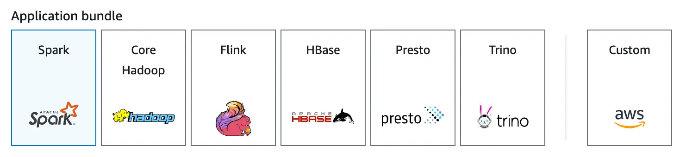
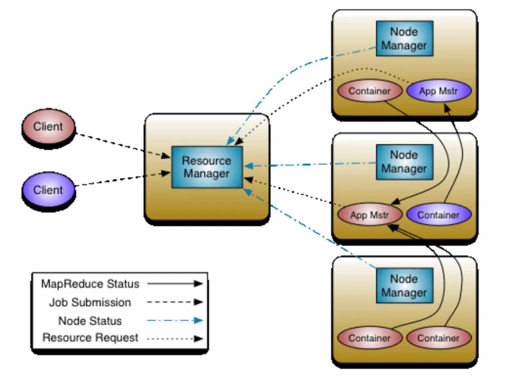
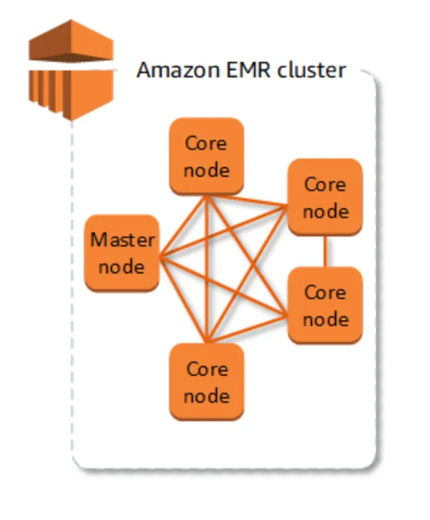

AWS EMR

# overview

Elastic MapReduce is a managed clustered platform to run big data frameworks. 

EMR is effective for OLAP (online analytical processing) and batch processing jobs. 
- at least TB worth of data processing
- suitable for "embarrassingly parallel" tasks, i.e.,  computational problems that can be easily divided into independent subtasks requiring little to no communication between them.
- By default, EMR uses YARN (yet another resource negotiator) for cluster resource management, with resource manager and node manager. 

  
*
YARN was introduced in Apache Hadoop 2.0
*

# Architecture for Amazon EMR

There are 3 node types

- primary node: coordinates distribution of data and tasks. Tracks status of tasks and monitors health of cluster.
- core node: Runs tasks and stores data in HDFS (Hadoop Distributed File System). In HDFS, data is stored across multiple instances, with multiple copies. Storage is ephemeral.
- task node: (optional) Runs tasks but does not store data.

EMR clusters are Elastic
- Horizontal scaling. 
- Set the number of on-demand instances for critical tasks, then provision the rest as spot instances. 

# run EMR job

This is done by triggering Steps. 

3 ways to trigger EMR steps
- management console
  - add step using spark application
- SSH into the primary node and manually run a task
  - ssh into the primary node
  - create main.py with the same content
  - `spark-submit main.py --data_source s3://path-to-csv --output_url s3://path-to-output`
- AWS CLI (recommended)
  - `aws emr add-steps --cluster-id j-******** --region us-east-1 --steps Type=CUSTOM_JAR,Name=MyThirdStep,ActionOnFailure=CONTINUE,Jar=command-runner.jar,Args="[spark-submit,s3://path-to-main.py, --data_source,s3://path-to-csv, --output_url,s3://path-to-outputs/]"`

We can also ssh into the resource node, to see the yarn logs wrt to application id. 

# EMR's compute platforms
 
- EC2: default. High performance and expensive
- EKS: light-weight app
- Serverless: small, low-code app.

# setup for this project

- create S3 bucket with subfolders inputs/, outputs/  and logs/. 
- create vpc with 2 public subnets, no private subnets.
- create EMR cluster
  - spark
  - no task node
  - 3 core nodes
  - select vpc created in step 2.
  - cluster logs save to logs/ create in step 1.
  - select a ssh key-pair for ssh later
  - create a service role: with vpc, subnet, security group from the just created VPC.
  - create an instance profile: give the EMR all s3 buckets access. 

# Download data
csv file from [link](https://data.kingcounty.gov/Health-Wellness/Food-Establishment-Inspection-Data/f29f-zza5/about_data)

